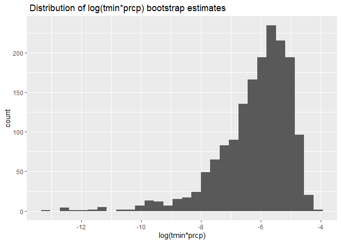
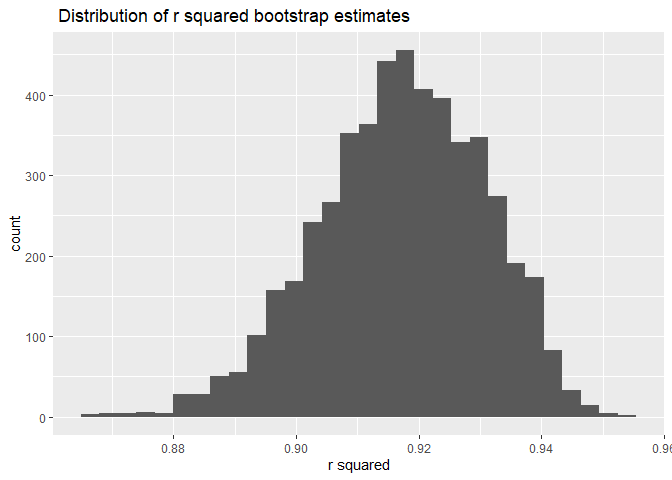
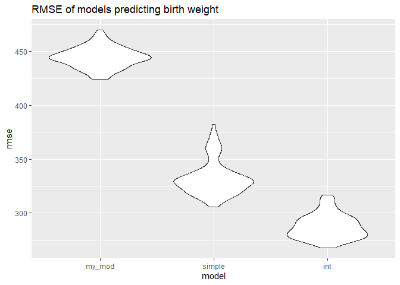

p8105_hw6_geg2145
================
Gustavo Garcia-Franceschini
2023-12-02

# Problem 1

The Washington Post has gathered data on homicides in 50 large U.S.
cities and made the data available through a GitHub repository.

Create a city_state variable (e.g. “Baltimore, MD”), and a binary
variable indicating whether the homicide is solved. Omit cities Dallas,
TX; Phoenix, AZ; and Kansas City, MO – these don’t report victim race.
Also omit Tulsa, AL – this is a data entry mistake. For this problem,
limit your analysis those for whom victim_race is white or black. Be
sure that victim_age is numeric.

``` r
df_homicide = read_csv("data/homicide-data.csv") %>%
  mutate(city_state = str_c(city, ", ", state),
         resolved = 1 - as.numeric((disposition == "Closed without arrest" | 
           disposition == "Open/No arrest")),
         victim_age = as.numeric(victim_age)) %>%
  filter((city_state != "Dallas, TX" & city_state != "Phoenix, AZ" & 
            city_state != "Kansas City, MO" & city_state != "Tulsa, AL") & 
           (victim_race == "White" | victim_race == "Black"))
```

    ## Rows: 52179 Columns: 12
    ## ── Column specification ────────────────────────────────────────────────────────
    ## Delimiter: ","
    ## chr (9): uid, victim_last, victim_first, victim_race, victim_age, victim_sex...
    ## dbl (3): reported_date, lat, lon
    ## 
    ## ℹ Use `spec()` to retrieve the full column specification for this data.
    ## ℹ Specify the column types or set `show_col_types = FALSE` to quiet this message.

    ## Warning: There was 1 warning in `mutate()`.
    ## ℹ In argument: `victim_age = as.numeric(victim_age)`.
    ## Caused by warning:
    ## ! NAs introduced by coercion

For the city of Baltimore, MD, use the glm function to fit a logistic
regression with resolved vs unresolved as the outcome and victim age,
sex and race as predictors. Save the output of glm as an R object; apply
the broom::tidy to this object; and obtain the estimate and confidence
interval of the adjusted odds ratio for solving homicides comparing male
victims to female victims keeping all other variables fixed.

``` r
model_baltimore = df_homicide %>%
  filter(city_state == "Baltimore, MD") %>%
  glm(resolved ~ victim_age + victim_race + victim_sex, data = ., 
      family = binomial()) 

model_baltimore %>%
  broom::tidy() %>%
  mutate(OR = exp(estimate),
         lower.bound = exp(estimate - 1.96*std.error),
         upper.bound = exp(estimate + 1.96*std.error)) %>%
  select(term, OR, lower.bound, upper.bound) %>%
  knitr::kable(digits = 3)
```

| term             |    OR | lower.bound | upper.bound |
|:-----------------|------:|------------:|------------:|
| (Intercept)      | 1.363 |       0.975 |       1.907 |
| victim_age       | 0.993 |       0.987 |       1.000 |
| victim_raceWhite | 2.320 |       1.648 |       3.268 |
| victim_sexMale   | 0.426 |       0.325 |       0.558 |

**When the victim is male, the homicide is less likely to be resolved
than if it were female, all other predictors held constant.**

Now run glm for each of the cities in your dataset, and extract the
adjusted odds ratio (and CI) for solving homicides comparing male
victims to female victims. Do this within a “tidy” pipeline, making use
of purrr::map, list columns, and unnest as necessary to create a
dataframe with estimated ORs and CIs for each city.

``` r
glm_cities_results = df_homicide %>%
  nest(data = -city_state) %>%
  mutate(
    models = map(data, \(df) glm(resolved ~ victim_age + victim_race + 
                                   victim_sex, data = df, family = binomial())),
    results = map(models, broom::tidy)) |> 
  select(-data, -models) |> 
  unnest(results) %>%
  filter(term == "victim_sexMale") %>%
  mutate(OR = exp(estimate),
         lower.bound = exp(estimate - 1.96*std.error),
         upper.bound = exp(estimate + 1.96*std.error)) %>%
  select(city_state, OR, lower.bound, upper.bound)

glm_cities_results %>% 
  head(4) %>%
  knitr::kable(digits = 3)
```

| city_state      |    OR | lower.bound | upper.bound |
|:----------------|------:|------------:|------------:|
| Albuquerque, NM | 1.767 |       0.831 |       3.761 |
| Atlanta, GA     | 1.000 |       0.684 |       1.463 |
| Baltimore, MD   | 0.426 |       0.325 |       0.558 |
| Baton Rouge, LA | 0.381 |       0.209 |       0.695 |

Create a plot that shows the estimated ORs and CIs for each city.
Organize cities according to estimated OR, and comment on the plot.

``` r
glm_cities_results %>%
  mutate(city_state = fct_reorder(city_state, OR)) %>%
  ggplot() + 
  geom_point(aes(x = city_state, y = OR)) + 
  geom_errorbar(aes(x = city_state, ymin = lower.bound, ymax = upper.bound)) +
  theme(axis.text.x = element_text(angle = 80, hjust = 1)) + 
  labs(title = "Odds ratio of homicide being solved if victim is male", 
       y = "Odds ratio", x = "City")
```

<!-- -->

**In the plot, we see that in cities like New York, Baton Rouge and
Omaha, homicides are likelier to go unresolved if the victim is male.
The confidence intervals of cities further right all include 1, so
homicides where the victim is male or female are equally likely to go
unsolved. No confidence interval lower bound is greater than 1 (which
would indicate homicides in that city are likelier to go unresolved if
the vicitm is female, compared to male).**

# Problem 2

For this problem, we’ll use the Central Park weather data similar to
data we’ve seen elsewhere. The code chunk below (adapted from the course
website) will download these data.

``` r
df_weather = 
  rnoaa::meteo_pull_monitors(
    c("USW00094728"),
    var = c("PRCP", "TMIN", "TMAX"), 
    date_min = "2022-01-01",
    date_max = "2022-12-31") |>
  mutate(
    name = recode(id, USW00094728 = "CentralPark_NY"),
    tmin = tmin / 10,
    tmax = tmax / 10) |>
  select(name, id, everything())
```

    ## using cached file: C:\Users\gusta\AppData\Local/R/cache/R/rnoaa/noaa_ghcnd/USW00094728.dly

    ## date created (size, mb): 2023-12-01 14:48:34.894884 (8.561)

    ## file min/max dates: 1869-01-01 / 2023-11-30

The bootstrap is helpful when you’d like to perform inference for a
parameter / value / summary that doesn’t have an easy-to-write-down
distribution in the usual repeated sampling framework. We’ll focus on a
simple linear regression with tmax as the response with `tmin` and
`prcp` as the predictors, and are interested in the distribution of two
quantities estimated from these data:

- $r^2$

- $log(\beta^1∗\beta^2)$

Use 5000 bootstrap samples and, for each bootstrap sample, produce
estimates of these two quantities. Plot the distribution of your
estimates, and describe these in words. Using the 5000 bootstrap
estimates, identify the 2.5% and 97.5% quantiles to provide a 95%
confidence interval for $r^2$ and $log(\beta^1∗\beta^2)$. Note:
`broom::glance()` is helpful for extracting $r^2$ from a fitted
regression, and `broom::tidy()` (with some additional wrangling) should
help in computing $log(\beta^1∗\beta^2)$.

``` r
bootstrap_results = 
  df_weather %>%
  modelr::bootstrap(n = 1000) %>%
  mutate(
    models = map(strap, \(df) lm(tmax ~ tmin + prcp, 
                                        data = df) ),
    estimates = map(models, broom::tidy),
    results = map(models, broom::glance)) %>% 
  select(-strap, -models) %>%
  unnest(estimates, results) %>%
  select(term, estimate, r.squared) %>%
  filter(term == "tmin" | term == "prcp") %>% 
  pivot_wider(names_from = term, values_from = estimate) %>%
  mutate(log.tmin.prcp = log(tmin*prcp)) %>%
  select(log.tmin.prcp, r.squared)
```

    ## Warning: `unnest()` has a new interface. See `?unnest` for details.
    ## ℹ Try `df %>% unnest(c(estimates, results))`, with `mutate()` if needed.

    ## Warning: There was 1 warning in `mutate()`.
    ## ℹ In argument: `log.tmin.prcp = log(tmin * prcp)`.
    ## Caused by warning in `log()`:
    ## ! NaNs produced

``` r
ggplot() + geom_histogram(data = bootstrap_results, aes(x = log.tmin.prcp)) +
  labs(title = " Distribution of log(tmin*prcp) bootstrap estimates", 
       x = "log(tmin*prcp)")
```

    ## `stat_bin()` using `bins = 30`. Pick better value with `binwidth`.

    ## Warning: Removed 642 rows containing non-finite values (`stat_bin()`).

<!-- -->

``` r
ggplot() + geom_histogram(data = bootstrap_results, aes(x = r.squared)) +
  labs(title = " Distribution of r squared bootstrap estimates", 
       x = "r squared")
```

    ## `stat_bin()` using `bins = 30`. Pick better value with `binwidth`.

<!-- -->

**The distribution of $log(\beta^1∗\beta^2)$ is skewed to the left, and
not a normal distribution. This means confidence intervals that assumed
a Normal distribution would have been wrong. It has a mean of around
-5.5. There are also 642 NAs as a result of taking the `log` of negative
values.**

**The distribution of $r^2$ is approximately Normal, with mean around
0.92 and some outliers to both sides.**

**These are the 95% confidence intervals for both $log(\beta^1∗\beta^2)$
and $r^2$.**

``` r
bootstrap_results %>%
  pivot_longer(log.tmin.prcp:r.squared, names_to = "estimate", 
               values_to = "value") %>%
  group_by(estimate) %>%
  summarize(
    ci_lower = quantile(value, 0.025, na.rm = T), 
    ci_upper = quantile(value, 0.975, na.rm = T)) %>%
  knitr::kable(digits = 3)
```

| estimate      | ci_lower | ci_upper |
|:--------------|---------:|---------:|
| log.tmin.prcp |   -9.321 |   -4.606 |
| r.squared     |    0.888 |    0.941 |

# Problem 3

In this problem, you will analyze data gathered to understand the
effects of several variables on a child’s birthweight. This dataset,
consists of roughly 4000 children and includes the following variables:

- `babysex`: baby’s sex (male = 1, female = 2)

- `bhead`: baby’s head circumference at birth (centimeters)

- `blength`: baby’s length at birth (centimeteres)

- `bwt`: baby’s birth weight (grams)

- `delwt`: mother’s weight at delivery (pounds)

- `fincome`: family monthly income (in hundreds, rounded)

- `frace`: father’s race (1 = White, 2 = Black, 3 = Asian, 4 = Puerto
  Rican, 8 = Other, 9 = Unknown)

- `gaweeks`: gestational age in weeks

- `malform`: presence of malformations that could affect weight (0 =
  absent, 1 = present)

- `menarche`: mother’s age at menarche (years)

- `mheigth`: mother’s height (inches)

- `momage`: mother’s age at delivery (years)

- `mrace`: mother’s race (1 = White, 2 = Black, 3 = Asian, 4 = Puerto
  Rican, 8 = Other)

- `parity`: number of live births prior to this pregnancy

- `pnumlbw`: previous number of low birth weight babies

- `pnumgsa`: number of prior small for gestational age babies

- `ppbmi`: mother’s pre-pregnancy BMI

- `ppwt`: mother’s pre-pregnancy weight (pounds)

- `smoken`: average number of cigarettes smoked per day during pregnancy

- `wtgain`: mother’s weight gain during pregnancy (pounds)

Load and clean the data for regression analysis (i.e. convert numeric to
factor where appropriate, check for missing data, etc.).

``` r
df_birthweight = read_csv("data/birthweight.csv") %>%
  mutate(
    babysex = case_when(
      babysex == 1 ~  "male",
      babysex == 2 ~  "female"
    ),
    frace = case_when(
      frace == 1 ~ "White",
      frace == 2 ~ "Black",
      frace == 3 ~ "Asian",
      frace == 4 ~ "Puerto Rican",
      frace == 8 ~ "Other",
      T ~ NA),
    malform = case_when(
      malform == 0 ~ " absent",
      malform == 1 ~ " present"
    ),
    mrace = case_when(
      mrace == 1 ~ "White",
      mrace == 2 ~ "Black",
      mrace == 3 ~ "Asian",
      mrace == 4 ~ "Puerto Rican",
      mrace == 8 ~ "Other",
      T ~ NA)
    ) %>%
  select(-pnumlbw,-pnumsga)
```

    ## Rows: 4342 Columns: 20
    ## ── Column specification ────────────────────────────────────────────────────────
    ## Delimiter: ","
    ## dbl (20): babysex, bhead, blength, bwt, delwt, fincome, frace, gaweeks, malf...
    ## 
    ## ℹ Use `spec()` to retrieve the full column specification for this data.
    ## ℹ Specify the column types or set `show_col_types = FALSE` to quiet this message.

Propose a regression model for `birthweight`. This model may be based on
a hypothesized structure for the factors that underly `birthweight`, on
a data-driven model-building process, or a combination of the two.
Describe your modeling process and show a plot of model residuals
against fitted values – use `add_predictions` and `add_residuals` in
making this plot.

**We first looked at the numeric variables that correlated the highest
with `bwt`.**

``` r
 df_birthweight %>%
  select_if(.,is.numeric) %>%
  cor(.) %>%
  as.data.frame() %>%
  add_rownames(var = "variable")  %>%
  tibble() %>%
  select(variable, bwt) %>%
  filter(abs(bwt) > 0.2) %>%
  knitr::kable(digits = 2)
```

    ## Warning: `add_rownames()` was deprecated in dplyr 1.0.0.
    ## ℹ Please use `tibble::rownames_to_column()` instead.
    ## Call `lifecycle::last_lifecycle_warnings()` to see where this warning was
    ## generated.

| variable |  bwt |
|:---------|-----:|
| bhead    | 0.75 |
| blength  | 0.74 |
| bwt      | 1.00 |
| delwt    | 0.29 |
| gaweeks  | 0.41 |
| wtgain   | 0.25 |

**From these, we will use `delwt`, `gaweeks` and `wtgain`, to avoid
using variables about the baby’s features to predict its birthweight. I
will also use the baby’s sex, since that is known well before they are
born**

``` r
my_fit = lm(bwt ~ delwt + gaweeks + wtgain + babysex, data = df_birthweight)

df_birthweight %>%
  modelr::add_residuals(my_fit) %>%
  modelr::add_predictions(my_fit) %>%
  ggplot(aes(x = pred, y = resid)) + geom_point(alpha = 0.25) + 
  labs(title = "Proposed linear model predictions and residuals",
       x = "Predictions", y = " Residuals")
```

<!-- -->

**From this plot, we can see that lower predictions have bigger
residuals (in terms of magnitude), which makes us worried that the
residuals are not independent from the predicted values. The variance of
the residuals also does not seem to be constant across predicted values.
These observations are indicative that all linear model assumptions
might not be met, and that we’d need bootstrap to interpret coefficient
estimates, as opposed to using the Normality assumption to get their
confidence intervals.**

Compare your model to two others:

- One using length at birth and gestational age as predictors (main
  effects only)

- One using head circumference, length, sex, and all interactions
  (including the three-way interaction) between these

Make this comparison in terms of the cross-validated prediction error;
use `crossv_mc` and functions in `purrr` as appropriate.

``` r
modelr::crossv_mc(df_birthweight, 100) %>%
  mutate(
    my_mod = map(train, \(df) lm(bwt ~ delwt + gaweeks + 
                                   wtgain + babysex, data = df)),
    
    simple_mod = map(train, \(df) lm(bwt ~ blength + gaweeks, data = df)),
    
    int_mod =  map(train, \(df) lm(bwt ~ bhead + blength + babysex +
                                     bhead*blength + bhead*babysex + 
                                     blength*babysex +
                                     bhead*blength*babysex, data = df))) %>%
  mutate(
    rmse_my_mod= map2_dbl(my_mod, test, \(mod, df) rmse(model = mod, 
                                                        data = df)),
    rmse_simple = map2_dbl(simple_mod, test, \(mod, df) rmse(model = mod, 
                                                             data = df)),
    rmse_int = map2_dbl(int_mod, test, \(mod, df) rmse(model = mod, 
                                                       data = df))) %>%
  select(starts_with("rmse")) %>%
  pivot_longer(
    everything(),
    names_to = "model", 
    values_to = "rmse",
    names_prefix = "rmse_") %>%
  mutate(model = fct_inorder(model)) %>%
  ggplot(aes(x = model, y = rmse)) + geom_violin() + 
  labs(title = "RMSE of models predicting birth weight")
```

<!-- -->

**In this plot, we see that our model had the highest RMSE, which makes
sense since it didn’t use any of the baby’s features at birth to predict
its birth weight. The model with interaction terms is the most flexible
one, and indeed the one with lowest RMSE.**

Note that although we expect your model to be reasonable, model building
itself is not a main idea of the course and we don’t necessarily expect
your model to be “optimal”.
